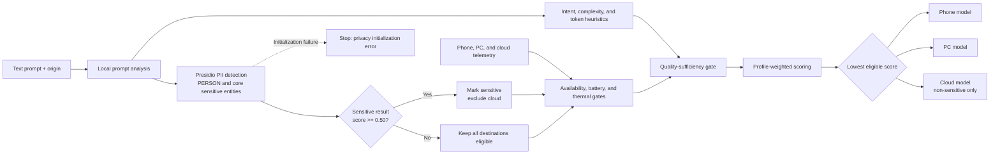

# EcoRouter

EcoRouter is a hardware-aware router for generative AI workloads. Given a text prompt, its
origin, and a telemetry snapshot, it selects one of three destinations:

- a model deployed on a phone;
- a model deployed on a PC; or
- a model deployed in the cloud.

The router analyzes prompts locally with Presidio, makes the routing decision, and can dispatch
it to deterministic simulated executors. It does not contact cloud services, collect telemetry,
or expose prompt or entity text in its diagnostics. The longer-term multimodal system is tracked
in [TODO.md](TODO.md).

## Requirements

- Python 3.11 or newer
- A virtual environment with the project dependencies installed

Create and activate a virtual environment on Windows, then install EcoRouter, Presidio Analyzer,
and the pinned English spaCy model:

```powershell
python -m venv .venv
.\.venv\Scripts\Activate.ps1
python -m pip install -e .
```

The editable install provides both invocation styles:

```powershell
python -m ecorouter route --origin phone --prompt "What's the weather tomorrow?"
ecorouter route --origin phone --prompt "What's the weather tomorrow?"
```

EcoRouter pins `presidio-analyzer==2.2.364` and `en_core_web_sm==3.8.0`. If either
dependency cannot initialize, routing fails closed with exit code `5`; there is no automatic
regex-only fallback.

For sensitive prompts, prefer stdin or `--prompt-file` so the text is not retained in shell
history:

```powershell
"Summarize the profile for John Smith" | python -m ecorouter route --origin pc
```

## CLI

Route without execution:

```powershell
python -m ecorouter route `
  --origin phone `
  --prompt "Compare three routing strategies step by step" `
  --profile balanced `
  --scenario healthy
```

Route and call the selected simulated executor:

```powershell
python -m ecorouter run `
  --origin pc `
  --prompt-file request.txt `
  --scenario pc-congested `
  --json
```

Available optimization profiles are `balanced`, `low-latency`, `energy-saver`, and
`high-quality`. Built-in telemetry scenarios are `healthy`, `phone-low-battery`,
`pc-congested`, and `cloud-offline`.

Use a real telemetry snapshot or custom model catalog with:

```powershell
python -m ecorouter route `
  --origin phone `
  --prompt "Summarize this note" `
  --telemetry examples/telemetry/healthy.json `
  --config examples/models.json
```

`--telemetry` and `--scenario` are mutually exclusive. When neither is supplied, the healthy
scenario is used.

## Python API

```python
from ecorouter import Device, EcoRouter, RouteRequest
from ecorouter.scenarios import built_in_scenarios

request = RouteRequest(
    prompt="What's the weather tomorrow?",
    origin=Device.PHONE,
    telemetry=built_in_scenarios()["healthy"],
)

decision = EcoRouter().route(request)
print(decision.selected_device, decision.model_id)
print(decision.explanation)
```

For a simulated end-to-end dispatch, call
`EcoRouter.run(request, default_simulated_executors())`. Real runtimes can replace the
simulators by implementing the `Executor.execute(prompt, decision)` protocol.

## Telemetry schema

The JSON root must contain exactly `phone`, `pc`, and `cloud`. Each object accepts:

| Field | Meaning |
| --- | --- |
| `available` | Whether the destination can accept a request |
| `network_latency_ms` | Network latency from the origin to this destination |
| `throughput_tokens_per_second` | Current estimated inference throughput |
| `energy_joules_per_token` | Current estimated energy efficiency |
| `utilization` | Load from `0.0` to `1.0` |
| `thermal_pressure` | Thermal pressure from `0.0` to `1.0` |
| `battery_percent` | Battery from `0` to `100`, or `null` when inapplicable |
| `cloud_cost_per_1k_tokens_usd` | Estimated token cost; normally zero for local devices |

For the origin device, network latency is treated as zero. See
[`examples/telemetry/healthy.json`](examples/telemetry/healthy.json) for a complete snapshot.

## Routing pipeline

1. Use local Presidio analysis to detect person names and other policy-selected PII at a
   minimum confidence of `0.50`; supplement it with the existing likely-secret detector.
2. Classify intent and estimate prompt complexity, input tokens, output tokens, and required
   quality with deterministic heuristics.
3. Exclude unavailable devices, local devices at or below 5% battery, local devices at or above
   0.95 thermal pressure, and cloud for sensitive prompts.
4. Prefer destinations whose configured capability meets the required quality.
5. Estimate latency, energy, and cloud cost and calculate a profile-weighted score. Lower is
   better.
6. If no eligible destination meets quality, select the highest-capability eligible model and
   mark the decision as degraded. For sensitive prompts this is necessarily local because
   privacy is never relaxed.



The hard privacy allowlist includes `PERSON`, `NRP`, email, phone, payment and financial
identifiers, government identifiers, medical-license identifiers, IP/MAC addresses, and
cryptocurrency addresses. Generic `LOCATION`, `DATE_TIME`, and `URL` findings are deliberately
excluded so prompts such as weather questions do not become sensitive solely because they name
a place or date. Only stable category names are retained; detected text and character offsets
are discarded. Presidio is an automated detector and cannot guarantee that every sensitive
value will be found; accuracy calibration and additional NLP models remain tracked in
[TODO.md](TODO.md). See the [Presidio Analyzer documentation](https://microsoft.github.io/presidio/analyzer/)
and [supported entity reference](https://microsoft.github.io/presidio/supported_entities/) for
the underlying recognizer behavior.

Latency is estimated from network delay and token throughput. Energy and cloud cost are
estimated from total tokens. The fixed normalization limits and profile weights live in
`ecorouter/router.py`; they are intentionally transparent and are candidates for later
calibration.

Default model IDs and capability scores are logical placeholders:

| Device | Model ID | Capability |
| --- | --- | ---: |
| Phone | `phone-model` | 0.60 |
| PC | `pc-model` | 0.80 |
| Cloud | `cloud-model` | 0.95 |

Change them with a model configuration shaped like [`examples/models.json`](examples/models.json)
or pass `DeviceConfig` objects to `EcoRouter` in Python.

## Tests

The suite uses the standard-library `unittest` runner and the installed privacy runtime:

```powershell
python -m unittest discover -s tests -v
```

## Current boundary

This repository implements the decision-making core and a portable demonstration surface.
Live device telemetry, actual phone/PC/cloud model adapters, multilingual or multimodal
ingestion, privacy-preserving redaction, learned performance prediction, an API, and a dashboard
are explicitly deferred and tracked in [TODO.md](TODO.md).
