# EcoRouter

EcoRouter is a hardware-aware router for generative AI workloads. Given a text prompt, its
origin, and a telemetry snapshot, it selects one of three destinations:

- a model deployed on a phone;
- a model deployed on a PC; or
- a model deployed in the cloud.

The router analyzes prompts locally with Presidio, makes the routing decision, and can dispatch
privacy-safe cloud requests to Cirrascale. Phone and PC execution remains simulated. Live cloud
access is explicit and never enabled by routing alone; prompt or entity text is not included in
routing diagnostics. The longer-term multimodal system is tracked in [TODO.md](TODO.md).

## Requirements

- Python 3.11 or newer
- A virtual environment with the project dependencies installed

Create and activate a virtual environment on Windows, then install EcoRouter, Presidio Analyzer,
and the pinned English spaCy model:

```powershell
python -m venv .venv
.\.venv\Scripts\Activate.ps1
python -m pip install -e .
```

To enable Cirrascale execution, install the optional cloud extra from the official Imagine SDK
0.4.2 wheel:

```powershell
python -m pip install -e ".[cloud]"
```

The editable install provides both invocation styles:

```powershell
python -m ecorouter route --origin phone --prompt "What's the weather tomorrow?"
ecorouter route --origin phone --prompt "What's the weather tomorrow?"
```

EcoRouter pins `presidio-analyzer==2.2.364` and `en_core_web_sm==3.8.0`. If either
dependency cannot initialize, routing fails closed with exit code `5`; there is no automatic
regex-only fallback.

For sensitive prompts, prefer stdin or `--prompt-file` so the text is not retained in shell
history:

```powershell
"Summarize the profile for John Smith" | python -m ecorouter route --origin pc
```

## CLI

Route without execution:

```powershell
python -m ecorouter route `
  --origin phone `
  --prompt "Compare three routing strategies step by step" `
  --profile balanced `
  --scenario healthy
```

Route and call the selected simulated executor:

```powershell
python -m ecorouter run `
  --origin pc `
  --prompt-file request.txt `
  --scenario pc-congested `
  --json
```

Live Cirrascale calls require an API key and an HTTPS endpoint in the current process
environment. Never put either value in source code, model configuration, command arguments, or a
committed `.env` file:

```powershell
$env:INFERENCE_CLOUD_API_KEY = "<rotated key>"
$env:INFERENCE_CLOUD_ENDPOINT = "https://aisuite.cirrascale.com/apis/v2"
python -m ecorouter cloud-models
```

`cloud-models` performs authenticated model discovery but does not send an inference prompt. It
supports `--json` and reports both the model count and IDs. The current default cloud model is
`Llama-3.1-8B`; live inference stops before sending the prompt if that model is unavailable.

Route the exact smoke-test prompt and invoke Cirrascale only if cloud wins the policy decision:

```powershell
python -m ecorouter run `
  --origin pc `
  --prompt "What model are you?" `
  --profile high-quality `
  --scenario healthy `
  --live-cloud `
  --json
```

Without `--live-cloud`, `run` remains entirely simulated. With it, phone and PC still use their
simulators and only a selected, non-sensitive cloud route makes a billable network request. Live
execution uses a 60-second timeout, one retry, TLS certificate verification, deterministic
temperature `0`, and the router's estimated output-token limit. Configuration or provider
failures produce sanitized execution errors with exit code `4`.

Every live Cirrascale inference also returns an optional `metrics` object. API turnaround is
measured with a monotonic clock around only `ImagineClient.chat()`; it excludes local privacy
analysis, routing, SDK initialization, and model discovery. Token counts come from the SDK
response. If usage is missing or malformed, the valid response is retained and token-dependent
energy fields are `null`.

```json
{
  "metrics": {
    "api_turnaround_latency_ms": 1234.567,
    "prompt_tokens": 8,
    "completion_tokens": 20,
    "total_tokens": 28,
    "measured_energy_joules": null,
    "estimated_energy_joules": 1.12,
    "energy_joules_per_token": 0.04,
    "energy_estimate_method": "actual_total_tokens_x_configured_joules_per_token",
    "energy_scope": "uncalibrated cloud inference estimate",
    "confidence": "uncalibrated"
  }
}
```

Available optimization profiles are `balanced`, `low-latency`, `energy-saver`, and
`high-quality`. Built-in telemetry scenarios are `healthy`, `phone-low-battery`,
`pc-congested`, and `cloud-offline`.

Use a real telemetry snapshot or custom model catalog with:

```powershell
python -m ecorouter route `
  --origin phone `
  --prompt "Summarize this note" `
  --telemetry examples/telemetry/healthy.json `
  --config examples/models.json
```

`--telemetry` and `--scenario` are mutually exclusive. When neither is supplied, the healthy
scenario is used.

## Python API

```python
from ecorouter import Device, EcoRouter, RouteRequest
from ecorouter.scenarios import built_in_scenarios

request = RouteRequest(
    prompt="What's the weather tomorrow?",
    origin=Device.PHONE,
    telemetry=built_in_scenarios()["healthy"],
)

decision = EcoRouter().route(request)
print(decision.selected_device, decision.model_id)
print(decision.explanation)
```

For a simulated end-to-end dispatch, call
`EcoRouter.run(request, default_simulated_executors())`. For simulated phone/PC execution plus
live Cirrascale cloud execution, call `EcoRouter.run(request, cirrascale_executors())`. The cloud
executor reads credentials lazily, verifies the selected model against Cirrascale's LLM catalog,
and refuses sensitive or non-cloud decisions. It additionally implements
`execute_observed(prompt, decision)` so `EcoRouter.run()` can attach live measurements without
making a second request. Other runtimes can keep implementing the unchanged
`Executor.execute(prompt, decision)` protocol; observation support is optional.

## Telemetry schema

The JSON root must contain exactly `phone`, `pc`, and `cloud`. Each object accepts:

| Field | Meaning |
| --- | --- |
| `available` | Whether the destination can accept a request |
| `network_latency_ms` | Network latency from the origin to this destination |
| `throughput_tokens_per_second` | Current estimated inference throughput |
| `energy_joules_per_token` | Current estimated energy efficiency |
| `utilization` | Load from `0.0` to `1.0` |
| `thermal_pressure` | Thermal pressure from `0.0` to `1.0` |
| `battery_percent` | Battery from `0` to `100`, or `null` when inapplicable |
| `cloud_cost_per_1k_tokens_usd` | Estimated token cost; normally zero for local devices |

For the origin device, network latency is treated as zero. See
[`examples/telemetry/healthy.json`](examples/telemetry/healthy.json) for a complete snapshot.

## Routing pipeline

1. Use local Presidio analysis to detect person names and other policy-selected PII at a
   minimum confidence of `0.50`; supplement it with the existing likely-secret detector.
2. Classify intent and estimate prompt complexity, input tokens, output tokens, and required
   quality with deterministic heuristics.
3. Exclude unavailable devices, local devices at or below 5% battery, local devices at or above
   0.95 thermal pressure, and cloud for sensitive prompts.
4. Prefer destinations whose configured capability meets the required quality.
5. Estimate latency, energy, and cloud cost and calculate a profile-weighted score. Lower is
   better.
6. If no eligible destination meets quality, select the highest-capability eligible model and
   mark the decision as degraded. For sensitive prompts this is necessarily local because
   privacy is never relaxed.

```mermaid
flowchart LR
    I["Text prompt + origin"] --> A["Local prompt analysis"]
    A --> P["Presidio PII detection<br/>PERSON and core sensitive entities"]
    A --> H["Intent, complexity, and token heuristics"]
    P --> G{"Sensitive result<br/>score >= 0.50?"}
    P -. "Initialization failure" .-> F["Stop: privacy initialization error"]
    G -- "Yes" --> L["Mark sensitive<br/>exclude cloud"]
    G -- "No" --> E["Keep all destinations eligible"]
    T["Phone, PC, and cloud telemetry"] --> D["Availability, battery, and thermal gates"]
    L --> D
    E --> D
    H --> Q["Quality-sufficiency gate"]
    D --> Q
    Q --> S["Profile-weighted scoring"]
    S --> R{"Lowest eligible score"}
    R --> PH["Phone model"]
    R --> PC["PC model"]
    R --> CL["Cloud model<br/>non-sensitive only"]
    PH --> LS["Simulated local executor"]
    PC --> LS
    CL --> CE["CirrascaleExecutor<br/>explicit --live-cloud"]
    CE --> IM["Imagine API<br/>model preflight + one chat call"]
    LS --> O["ExecutionResult"]
    IM --> M["Observed API latency + SDK tokens<br/>energy estimate; measured energy unavailable"]
    M --> O
```



The hard privacy allowlist includes `PERSON`, `NRP`, email, phone, payment and financial
identifiers, government identifiers, medical-license identifiers, IP/MAC addresses, and
cryptocurrency addresses. Generic `LOCATION`, `DATE_TIME`, and `URL` findings are deliberately
excluded so prompts such as weather questions do not become sensitive solely because they name
a place or date. Only stable category names are retained; detected text and character offsets
are discarded. Presidio is an automated detector and cannot guarantee that every sensitive
value will be found; accuracy calibration and additional NLP models remain tracked in
[TODO.md](TODO.md). See the [Presidio Analyzer documentation](https://microsoft.github.io/presidio/analyzer/)
and [supported entity reference](https://microsoft.github.io/presidio/supported_entities/) for
the underlying recognizer behavior.

Routing-time latency is predicted from network delay and token throughput. Routing-time energy
and cloud cost are predicted from estimated total tokens. For live cloud calls, API turnaround
is instead directly timed and the SDK's actual total-token count is multiplied by the selected
cloud telemetry coefficient, currently `0.04 J/token` in the healthy scenario.

That live energy value is an **uncalibrated estimate**, not a Cirrascale server measurement.
Cirrascale's documented response DTOs expose token usage but no request-level power or energy
telemetry. The estimate cannot account for unknown GPU type, batching and concurrent users,
utilization, CPU/RAM and networking energy, cooling, or data-center PUE. See the
[Cirrascale response DTOs](https://aisuite.cirrascale.com/sdk/api/dtos.html) and
[`ImagineClient` usage API](https://aisuite.cirrascale.com/sdk/api/imagine_clients.html).

For direct measurement on controlled server hardware, read a supported NVIDIA GPU's cumulative
energy counter immediately before and after an isolated request, then subtract an idle baseline.
Attribute CPU/RAM/node energy separately with CPU RAPL counters or a rack PDU/wall meter, account
for concurrent work, and optionally apply PUE. NVIDIA documents the cumulative millijoule counter
in the [NVML device query API](https://docs.nvidia.com/deploy/nvml-api/group__nvmlDeviceQueries.html).
Client-side tools such as CodeCarbon measure the machine running EcoRouter; for a remote API that
mostly captures the PC waiting on the network and is not cloud inference energy. See the
[CodeCarbon methodology](https://mlco2.github.io/codecarbon/methodology.html). A stronger
black-box estimator would calibrate separate input-token/prefill and output-token/decode
coefficients on known hardware.

The fixed normalization limits and profile weights live in `ecorouter/router.py`; they are
intentionally transparent and remain candidates for benchmark calibration. A model's answer to
an account-limit question is generated text, not authoritative quota information; use a
documented provider account or usage endpoint for account facts.

Default model IDs and capability scores are:

| Device | Model ID | Capability |
| --- | --- | ---: |
| Phone | `phone-model` | 0.60 |
| PC | `pc-model` | 0.80 |
| Cloud | `Llama-3.1-8B` | 0.95 |

Change them with a model configuration shaped like [`examples/models.json`](examples/models.json)
or pass `DeviceConfig` objects to `EcoRouter` in Python.

The Cirrascale integration follows the official
[Imagine SDK setup](https://aisuite.cirrascale.com/sdk/index.html),
[model discovery and chat tutorial](https://aisuite.cirrascale.com/sdk/tutorials/1_0_basic_usage.html),
and [`ImagineClient` API](https://aisuite.cirrascale.com/sdk/api/imagine_clients.html). The SDK is
loaded only by live cloud operations, so routing and simulation do not require cloud credentials.

## Tests

The suite uses the standard-library `unittest` runner and the installed privacy runtime:

```powershell
python -m unittest discover -s tests -v
```

## Current boundary

This repository implements the decision-making core, a real non-streaming Cirrascale cloud
adapter with per-call API latency and SDK token observations, and simulated phone/PC adapters.
Cloud energy remains an uncalibrated token-based estimate because provider-side measurements are
not available. Live device telemetry, real local model runtimes, streaming and cancellation,
multilingual or multimodal ingestion, privacy-preserving redaction, learned performance
prediction, an API, and a dashboard are explicitly deferred and tracked in [TODO.md](TODO.md).
