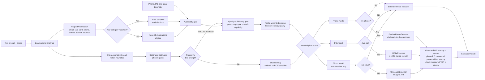

# PEQRouter

PEQRouter is a hardware-aware router for generative AI workloads. Given a text prompt, its
origin, and a telemetry snapshot, it selects one of three destinations:

- a model deployed on a phone;
- a model deployed on a PC; or
- a model deployed in the cloud.

The router analyzes prompts locally with a dependency-free regex-based heuristic, makes the
routing decision, and can dispatch the selected destination to a real executor: Cirrascale for
the cloud, the local Snapdragon X-Elite NPU server for the PC (`x_elite_laptop_server`), and the
phone's own in-app GenieX inference server for the phone (`s25_android_app`). Any destination
without its `--live-*` flag stays simulated. Live execution is explicit per destination and never
enabled by routing alone; prompt or entity text is not included in routing diagnostics. The
longer-term multimodal system is tracked in [TODO.md](TODO.md).

## Requirements

- Python 3.11 or newer
- A virtual environment with the project dependencies installed

Create and activate a virtual environment on Windows, then install PEQRouter:

```powershell
python -m venv .venv
.\.venv\Scripts\Activate.ps1
python -m pip install -e .
```

To enable Cirrascale execution, install the optional cloud extra from the official Imagine SDK
0.4.2 wheel:

```powershell
python -m pip install -e ".[cloud]"
```

The editable install provides both invocation styles:

```powershell
python -m peqrouter route --origin phone --prompt "What's the weather tomorrow?"
peqrouter route --origin phone --prompt "What's the weather tomorrow?"
```

The privacy analyzer has no NLP dependency (no Presidio/spaCy), so there is no separate model
download and nothing to fail closed on at startup. See [Routing pipeline](#routing-pipeline) for
what it does and does not catch; an NLP-backed analyzer (e.g. Presidio) is tracked as possible
future work in [TODO.md](TODO.md) if regex recall proves insufficient.

Routing itself has no required dependencies. The calibrated per-prompt quality estimator (see
[Calibrated quality estimator](#calibrated-quality-estimator)) is optional and needs `torch` +
`transformers` plus a locally cached copy of `sentence-transformers/all-MiniLM-L6-v2` — install
those separately if you want it. Without them, or with `--no-estimator`, the router falls back to
its static per-device capability comparison automatically; nothing else changes.

For sensitive prompts, prefer stdin or `--prompt-file` so the text is not retained in shell
history:

```powershell
"Summarize the profile for John Smith" | python -m peqrouter route --origin pc
```

## CLI

Route without execution:

```powershell
python -m peqrouter route `
  --origin phone `
  --prompt "Compare three routing strategies step by step" `
  --profile balanced `
  --scenario healthy
```

Route and call the selected simulated executor:

```powershell
python -m peqrouter run `
  --origin pc `
  --prompt-file request.txt `
  --scenario pc-congested `
  --json
```

Live Cirrascale calls require an API key and an HTTPS endpoint in the current process
environment. Never put either value in source code, model configuration, command arguments, or a
committed `.env` file:

```powershell
$env:INFERENCE_CLOUD_API_KEY = "<rotated key>"
$env:INFERENCE_CLOUD_ENDPOINT = "https://aisuite-indonesia.cirrascale.com/apis/v2"
python -m peqrouter cloud-models
```

`cloud-models` performs authenticated model discovery but does not send an inference prompt. It
supports `--json` and reports both the model count and IDs. The current default cloud model is
`Llama-3.3-70B`; live inference stops before sending the prompt if that model is unavailable.

Route the exact smoke-test prompt and invoke Cirrascale only if cloud wins the policy decision:

```powershell
python -m peqrouter run `
  --origin pc `
  --prompt "What model are you?" `
  --profile high-quality `
  --scenario healthy `
  --live-cloud `
  --json
```

Without any `--live-*` flag, `run` remains entirely simulated. Each flag makes only its own
destination live; the other two keep using their simulators. Live cloud execution uses a
60-second timeout, one retry, TLS certificate verification, deterministic temperature `0`, and
the router's estimated output-token limit. Configuration or provider failures produce sanitized
execution errors with exit code `4`.

Every live executor also returns an optional `metrics` object. API turnaround is measured with a
monotonic clock around only the network call; it excludes local privacy analysis, routing, SDK
initialization, and model discovery. Token counts come from the executor's response. If usage is
missing or malformed, the valid response is retained and token-dependent energy fields are `null`.
Live cloud calls always populate `measured_energy_joules` (rated TDP x observed latency, see
[Energy honesty](#energy-honesty)):

```json
{
  "metrics": {
    "api_turnaround_latency_ms": 1234.567,
    "prompt_tokens": 8,
    "completion_tokens": 20,
    "total_tokens": 28,
    "measured_energy_joules": 92.592525,
    "estimated_energy_joules": 62.930776,
    "energy_joules_per_token": 2.247528,
    "energy_estimate_method": "cloud_accelerator_tdp_x_latency",
    "energy_scope": "Qualcomm Cloud AI 100 rated TDP (75 W) x wall-clock request latency; not an on-device power measurement -- includes network and queueing time and does not account for multi-tenant sharing of the accelerator",
    "confidence": "measured"
  }
}
```

`estimated_energy_joules` (the uncalibrated tokens x J/token fallback) is still computed and
returned alongside the measured figure for comparison; only `measured_energy_joules` and
`confidence` are `null`/`"uncalibrated"` when a live executor genuinely can't report a
measurement — e.g. a custom `ObservedExecutor` that doesn't implement one.

### Live PC execution

`--live-pc` sends the routed request to `x_elite_laptop_server/serve_qwen_vl.py`, an
OpenAI-compatible server for the Snapdragon X-Elite Hexagon NPU:

```powershell
$env:XELITE_SERVER_ENDPOINT = "http://localhost:8000"  # default; set only if different
python -m peqrouter run --origin pc --prompt "What model are you?" --scenario healthy --live-pc --json
```

### Live phone execution

`--live-phone` sends the routed request to the Android app's in-app inference server
(`s25_android_app`, `InferenceService`). The connection is **wireless LAN, not USB** — the phone
must stay unplugged for its energy measurements to be valid (see [Energy honesty](#energy-honesty)
below), so this is a deliberate design choice, not an oversight. In the app: load a model, flip
the "Router server" switch, and it displays its LAN address, port, and a bearer token. Point
PEQRouter at that address and pass the token through the environment, never on the command line
or in source:

```powershell
$env:PHONE_SERVER_ENDPOINT = "http://192.168.1.42:8080"
$env:PHONE_SERVER_TOKEN = "<token shown in the app>"
python -m peqrouter phone-health
python -m peqrouter run --origin phone --prompt "What model are you?" --scenario healthy --live-phone --json
```

`phone-health` checks the server's unauthenticated `/health` endpoint (model loaded, uptime,
requests served) without spending a generation. Live phone execution has a 120-second timeout to
accommodate on-device decode; the server rejects a second concurrent request (`429`) rather than
racing the native model handle, and rejects requests without a valid bearer token (`401`).

Available optimization profiles are `balanced`, `low-latency`, `low-energy`, and
`high-quality`. Built-in telemetry scenarios are `healthy`, `phone-low-battery`,
`pc-congested`, and `cloud-offline`. Both `route` and `run` accept `--no-estimator` to skip the
calibrated per-prompt quality estimator and use static capability scores only (see
[Calibrated quality estimator](#calibrated-quality-estimator)).

Use a real telemetry snapshot or custom model catalog with:

```powershell
python -m peqrouter route `
  --origin phone `
  --prompt "Summarize this note" `
  --telemetry examples/telemetry/healthy.json `
  --config examples/models.json
```

`--telemetry` and `--scenario` are mutually exclusive. When neither is supplied, the healthy
scenario is used.

## Phone app (`s25_android_app`)

The Android app in [`s25_android_app`](s25_android_app) is what `--live-phone` talks to. It's a
Gradle project (`minSdk 31`, `compileSdk 34`) built with Android Studio or
`./gradlew assembleDebug`. Besides the existing GenieX chat demo, it now runs
`InferenceService` — a bound **foreground service** that owns the loaded model and a NanoHTTPD
server (`org.nanohttpd:nanohttpd`) exposing `/v1/chat/completions`, `/health`, and `/metrics` on
the LAN. It's a foreground service specifically so serving continues while the app is
backgrounded or the screen is off, which matters for the wireless power-measurement workflow (see
[Energy honesty](#energy-honesty)). The service and the UI's own chat both drive the same native
model handle through one `Mutex`, since concurrent `generate()` calls crash the app.

To use it: load a model in the app, flip the "Router server" switch (adds
`FOREGROUND_SERVICE`/`FOREGROUND_SERVICE_CONNECTED_DEVICE`/`POST_NOTIFICATIONS` permissions to the
manifest), and read the LAN address, port, and bearer token it displays — feed those into
`PHONE_SERVER_ENDPOINT`/`PHONE_SERVER_TOKEN` as shown above. Streaming is intentionally not
implemented on this endpoint; every routed request is non-streaming end-to-end, matching the PC
and cloud executors.

## Python API

```python
from peqrouter import Device, PEQRouter, RouteRequest
from peqrouter.scenarios import built_in_scenarios

request = RouteRequest(
    prompt="What's the weather tomorrow?",
    origin=Device.PHONE,
    telemetry=built_in_scenarios()["healthy"],
)

decision = PEQRouter().route(request)
print(decision.selected_device, decision.model_id)
print(decision.explanation)
```

For a simulated end-to-end dispatch, call
`PEQRouter.run(request, default_simulated_executors())`. To make one or more destinations live,
call `PEQRouter.run(request, build_executors(live_phone=..., live_pc=..., live_cloud=...))` —
this is what the CLI's `--live-phone`/`--live-pc`/`--live-cloud` flags use; any destination
whose flag is left `False` stays simulated. `cirrascale_executors()`, `x_elite_executors()`,
and `hybrid_executors()` remain as thin single/dual-destination wrappers around it. Each live
executor (`CirrascaleExecutor`, `XEliteExecutor`, `GenieXPhoneExecutor`) reads its connection
details lazily from the environment and refuses a decision for a device it doesn't serve. They
implement `execute_observed(prompt, decision)` so `PEQRouter.run()` can attach live measurements
— including, where the provider reports them, throughput (`ttft_ms`,
`prefill_speed_tokens_per_second`, `decode_speed_tokens_per_second`) and the phone's measured
`measured_energy_joules`/`tokens_per_joule` — without making a second request. Other runtimes can
keep implementing the unchanged `Executor.execute(prompt, decision)` protocol; observation
support is optional.

## Telemetry schema

The JSON root must contain exactly `phone`, `pc`, and `cloud`. Each object accepts:

| Field | Meaning |
| --- | --- |
| `available` | Whether the destination can accept a request |
| `network_latency_ms` | Network latency from the origin to this destination |
| `throughput_tokens_per_second` | Current estimated inference throughput |
| `energy_joules_per_token` | Current estimated energy efficiency |
| `utilization` | Load from `0.0` to `1.0` |
| `thermal_pressure` | Thermal pressure from `0.0` to `1.0` |
| `battery_percent` | Battery from `0` to `100`, or `null` when inapplicable |
| `cloud_cost_per_1k_tokens_usd` | Estimated token cost; normally zero for local devices |

For the origin device, network latency is treated as zero. See
[`examples/telemetry/healthy.json`](examples/telemetry/healthy.json) for a complete snapshot.

## Routing pipeline

1. Use local regex analysis to detect email, SSN, payment card, phone number, secret-looking
   strings (`api_key=...`, `password:...`), person names (consecutive Title-Case words), and
   street addresses (house number + street suffix). No NLP dependency and no network calls.
2. Classify intent and estimate prompt complexity, input tokens, output tokens, and required
   quality with deterministic heuristics.
3. Exclude unavailable devices and cloud for sensitive prompts. (Battery and thermal pressure
   are reported in telemetry but no longer gate or score routing.)
4. Judge quality sufficiency per destination. If the calibrated estimator (see
   [Calibrated quality estimator](#calibrated-quality-estimator)) is configured and has a
   trusted prediction for this prompt, that's a hard per-prompt gate. Otherwise, fall back to
   comparing the destination's static capability score against the prompt's required quality.
5. If the estimator's prediction is untrusted (this prompt is outside its calibration domain),
   skip scoring entirely and default straight to cloud — or PC if the prompt is privacy-sensitive
   — rather than let an extrapolated number decide.
6. Otherwise, estimate latency and energy and calculate a profile-weighted score from latency,
   energy, and quality (capability score, scored on every eligible candidate as a preference, not
   just a gate). Lower is better. (Cloud cost is still predicted and reported but not scored.)
7. If no eligible destination meets quality, select the highest-capability eligible model and
   mark the decision as degraded. For sensitive prompts this is necessarily local because
   privacy is never relaxed.



Detection is deliberately blunt and biased toward over-matching: the person/address patterns also
trigger on things like book titles or "United Kingdom", which only costs a missed cloud-routing
opportunity. Over-blocking cloud is the safe failure direction; under-blocking is the one that
leaks PII, which is why there's no confidence threshold to tune here unlike an NLP detector. Only
stable category names are retained; matched text is discarded. This is not a substitute for an
NLP-based detector for entities regex fundamentally can't express (e.g. it will not catch names
that aren't Title-Case, or identifiers with no fixed format); calibrating precision/recall and
evaluating whether an NLP-backed analyzer (e.g. Presidio) is warranted remain tracked in
[TODO.md](TODO.md).

### Calibrated quality estimator

`peqrouter.estimator.CalibratedEstimator` (`peqrouter/estimator.py`) replaces two numbers that
would otherwise be static guesses: whether a device is good enough for *this* prompt, and how
long its answer will run. It's a k-NN lookup over MiniLM embeddings of a 106-prompt calibration
set (`benchmarks/calibration/prompts.json`), fitted by `benchmarks/calibration/fit_heads.py` into
`benchmarks/calibration/heads/{heads.json,heads.npz}`. It is optional — `PEQRouter(estimator=...)`
— and the CLI wires it in by default (`peqrouter/cli.py`, `HEADS_DIR` resolved relative to the
package, not the working directory) unless `--no-estimator` is passed or construction fails, in
which case a one-line notice goes to stderr and routing falls back to the static
capability-score comparison automatically.

For a given prompt, the estimator reports, per device: `p_pass` (probability this device answers
correctly, from the *k*=5 nearest calibration prompts by cosine similarity) and predicted answer
length (p50/p90 token counts). A prediction is **trusted** only when the prompt's nearest
calibration neighbour is close enough (similarity ≥ a floor measured from the calibration set
itself) *and* its intent was actually covered by calibration — a request for a poem has no
evidence behind it regardless of what the embedding says. Untrusted predictions make the router
abstain rather than act on a confident-looking but unfounded number (see step 5 above).

When trusted, `p_pass >= quality_floor` (default `0.5`) becomes each device's quality gate,
replacing the static `capability_score >= required_quality` comparison, and the p90 length caps
what's actually sent to the executor (so a small on-device model isn't handed a budget far larger
than anything it produced during calibration). A device needs at least `min_labels_per_device`
(default `20`) graded calibration examples before its head is consulted at all; below that it
reports `p_pass = None` and falls back to the static rule for that device specifically. All three
devices clear this bar today (phone/PC/cloud: 106/106/100 graded examples).

The embedding model is pinned to the exact snapshot already verified on this machine
(`revision="1110a243..."`, `local_files_only=True`) so it never reaches the network — it only
works because the weights are already in this machine's Hugging Face cache. A machine without
that cache needs one online run (or `huggingface-cli download`) first; until then, construction
raises `EstimatorUnavailableError` and the CLI falls back the same way.

### Energy honesty

There are three distinct energy numbers in play, and cloud is the one device where they're
computed differently from each other:

- **`CandidateEvaluation.predicted_energy_joules`** — computed for every candidate at routing
  time, before anything is dispatched, and is what the profile-weighted score actually uses (see
  [Profile weights and calibration results](#profile-weights-and-calibration-results)). Phone/PC:
  `total_tokens x J/token`. Cloud: `CLOUD_AI_100_TDP_WATTS x predicted_latency` — not
  tokens-based at all.
- **`ExecutionMetrics.estimated_energy_joules`** — computed by `PEQRouter.run()` as an
  always-available "uncalibrated" comparison figure alongside whatever `measured_energy_joules`
  a live executor reports (or in place of it, if the executor doesn't report one).
  `PEQRouter.run()` labels its `energy_scope` per device (`"uncalibrated cloud inference
  estimate"`, `"uncalibrated PC (X-Elite NPU) inference estimate"`) rather than always saying
  "cloud". Unlike the routing-time figure above, this one *is* `total_tokens x J/token` for every
  device, cloud included — it exists for side-by-side comparison against a measurement, not as a
  best estimate in its own right, so it wasn't worth special-casing the same way.
- **`ExecutionMetrics.measured_energy_joules`** — from a live executor's own observation (see
  below); `None` when not available.

Phone and PC's `J/token` is a real measured per-token energy constant; cloud's is derived, not
measured (see below). The constants (from the 106-prompt calibration sweep,
`benchmarks/calibration/heads/heads.json`), not illustrative guesses:

| Device | Model | Decode throughput | Energy | Samples |
| --- | --- | ---: | ---: | ---: |
| Phone | Qwen3-0.6B | 94.22 tok/s | 0.0412 J/token | 106 |
| PC | Qwen3-VL-4B-Instruct (X-Elite NPU) | 20.19 tok/s | 0.4447 J/token | 106 |
| Cloud | Llama-3.3-70B | 33.37 tok/s* | 2.2475 J/token† | 100 |

\* Cirrascale exposes no decode-only timing, so this is the median **end-to-end** rate — (prompt +
completion tokens) / whole-call latency — from `benchmarks/calibration/runs/
sweep_cloud_llama70b.jsonl`, folding network and queueing time into the number since they were
never captured separately. Cloud's `network_latency_ms` telemetry is therefore `0`, not a second
additive hop — adding one on top would double-count time already inside this rate.

† Not directly measured — derived as `CLOUD_AI_100_TDP_WATTS / cloud throughput` (75 W is the
Qualcomm Cloud AI 100 accelerator's rated TDP per the
[QuIC Cloud AI SDK docs](https://quic.github.io/cloud-ai-sdk-pages/latest/Getting-Started/Architecture/),
not something measured on this hardware) — and, per the `network_latency_ms` note above, not
purely compute time either. `_evaluate()` in `peqrouter/router.py` doesn't actually use this
field for cloud; it computes predicted cloud energy directly as `CLOUD_AI_100_TDP_WATTS x
predicted_latency`, since a shared accelerator running at roughly fixed power for however long a
request takes has no meaningful *per-token* rate the way a dedicated local NPU does. This field
exists only so `DeviceTelemetry` stays internally consistent for other callers (e.g. the
uncalibrated-estimate fallback below).

PC/phone's `network_latency_ms` (8/18 ms) remains an illustrative, unmeasured LAN-hop
placeholder — nothing in this repo measures cross-device network latency, so unlike the constants
above this number was left alone rather than replaced with false precision.

For live cloud and PC calls, API turnaround is instead directly timed. Cirrascale's documented
response DTOs expose token usage but no request-level power or energy telemetry, and
`serve_qwen_vl.py` does not read NPU power counters either — so even "measured" energy below is a
power (or TDP) figure times observed latency, not a literal per-request sensor reading. See the
[Cirrascale response DTOs](https://aisuite.cirrascale.com/sdk/api/dtos.html) and
[`ImagineClient` usage API](https://aisuite.cirrascale.com/sdk/api/imagine_clients.html).

All three destinations can report `measured_energy_joules` / `confidence: "measured"` in place of
the token-based estimate, each with its own caveats:

- **Phone**: `s25_android_app`'s `InferenceService.measuredNpuPowerMw()` holds a table of
  whole-phone battery-discharge power (mW) during sustained decode, minus an idle baseline
  (~796 mW), calibrated per model+bundle on that exact hardware — currently three catalog
  entries. It only applies when the loaded model is one of those three, it's running on the
  **NPU** (gated by `computeUnitIsNpu`, not GPU/CPU), and the phone is **not charging** (checked
  via `BatteryManager` on every request) — this is also why the phone server is wireless-only
  (see [Live phone execution](#live-phone-execution)): a USB cable would charge the phone and
  invalidate every measurement in that table. Outside those conditions
  `phone_profile.energy_available` is `false`, `GenieXPhoneExecutor` leaves
  `measured_energy_joules` as `None`, and `PEQRouter.run()` falls back to the uncalibrated
  per-token estimate. One caveat the measurement does not isolate: routing arrives over Wi-Fi, so
  the reported energy is decode energy plus whatever the radio drew answering that request — not
  excluded from the whole-device discharge figure. Request/response payloads for these prompt
  sizes are small, so the error this introduces is expected to be small, but it is not zero.
- **PC**: `serve_qwen_vl.py`'s `_MEASURED_NPU_POWER_MW` table (whole-laptop battery discharge
  during sustained NPU-serving load, minus an idle baseline, unplugged) times observed decode
  latency, covering prefill + decode. Same shape as phone's measurement, same "not charging"
  requirement.
- **Cloud**: `CirrascaleExecutor` always reports a value — `CLOUD_AI_100_TDP_WATTS x observed
  API turnaround latency`. It's the same rated-TDP tradeoff as the predicted figure above (not an
  on-device power measurement, includes network and queueing time, and doesn't account for
  multi-tenant sharing of the accelerator), so treat it as a rougher upper bound, not a
  calibrated per-request measurement.

For direct measurement on controlled server hardware, read a supported NVIDIA GPU's cumulative
energy counter immediately before and after an isolated request, then subtract an idle baseline.
Attribute CPU/RAM/node energy separately with CPU RAPL counters or a rack PDU/wall meter, account
for concurrent work, and optionally apply PUE. NVIDIA documents the cumulative millijoule counter
in the [NVML device query API](https://docs.nvidia.com/deploy/nvml-api/group__nvmlDeviceQueries.html).
Client-side tools such as CodeCarbon measure the machine running PEQRouter; for a remote API that
mostly captures the PC waiting on the network and is not cloud inference energy. See the
[CodeCarbon methodology](https://mlco2.github.io/codecarbon/methodology.html). A stronger
black-box estimator would calibrate separate input-token/prefill and output-token/decode
coefficients on known hardware.

A model's answer to an account-limit question is generated text, not authoritative quota
information; use a documented provider account or usage endpoint for account facts.

### Profile weights and calibration results

`peqrouter/router.py::_PROFILE_WEIGHTS` scores every eligible candidate as a weighted sum of
latency, energy, and quality penalties (each clamped to `[0, 1]`; lower score wins):

| Profile | Latency | Energy | Quality |
| --- | ---: | ---: | ---: |
| balanced | 0.500 | 0.333 | 0.167 |
| low-latency | 0.850 | 0.075 | 0.075 |
| low-energy | 0.150 | 0.800 | 0.050 |
| high-quality | 0.100 | 0.100 | 0.800 |

The quality penalty (`1 - capability_score`) is scored on every eligible candidate, not just when
the calibrated estimator is absent or untrusted — it's a ranking preference among already-eligible
devices, layered on top of (not instead of) the calibrated per-prompt hard gate described in
[Calibrated quality estimator](#calibrated-quality-estimator). The energy penalty is
`energy_joules / 700` and the latency penalty is `latency_ms / 10_000`, both clamped at `1.0`; 700
joules was chosen against the real constants above (roughly a long, ~9-second sustained-cloud
response) rather than the old illustrative numbers, which made every real request saturate the
penalty near its ceiling regardless of profile.

Routing all 106 calibration prompts (`benchmarks/calibration/prompts.json`) through the router
with the calibrated estimator wired in, healthy telemetry, origin PC:

| Profile | Phone | PC | Cloud |
| --- | ---: | ---: | ---: |
| balanced | 48 | 31 | 27 |
| low-latency | 51 | 8 | 47 |
| low-energy | 52 | 45 | 9 |
| high-quality | 0 | 15 | 91 |

These prompts are also what the estimator was calibrated on, so every prediction is trusted here
(similarity to itself is always 1.0) — this distribution reflects the latency/energy/quality
scoring tradeoff, not the untrusted-estimate fallback policy (routing pipeline step 5), which only
fires on prompts genuinely unlike anything in the calibration set.

Default model IDs and capability scores — the static fallback used when the calibrated estimator
is absent, untrusted, or has too few labels for a device, not something the estimator overrides
in place:

| Device | Model ID | Capability |
| --- | --- | ---: |
| Phone | `phone-model` | 0.60 |
| PC | `pc-model` | 0.80 |
| Cloud | `Llama-3.3-70B` | 0.95 |

Change them with a model configuration shaped like [`examples/models.json`](examples/models.json)
or pass `DeviceConfig` objects to `PEQRouter` in Python. These remain illustrative, uncalibrated
numbers — see [TODO.md](TODO.md).

The Cirrascale integration follows the official
[Imagine SDK setup](https://aisuite.cirrascale.com/sdk/index.html),
[model discovery and chat tutorial](https://aisuite.cirrascale.com/sdk/tutorials/1_0_basic_usage.html),
and [`ImagineClient` API](https://aisuite.cirrascale.com/sdk/api/imagine_clients.html). The SDK is
loaded only by live cloud operations, so routing and simulation do not require cloud credentials.

## Tests

The suite uses the standard-library `unittest` runner and has no required dependencies:

```powershell
python -m unittest discover -s tests -v
```

`tests/test_estimator.py` needs `torch` + `transformers` importable (it patches
`transformers.AutoTokenizer`/`AutoModel`, matching the estimator's own optional dependency — see
[Requirements](#requirements)); the rest of the suite has no such requirement. All of the above
run offline against mocked HTTP calls. To exercise the real phone, PC, and cloud destinations end
to end, run the live smoke test:

```powershell
python scripts/smoke_test.py
```

It checks `/health` on the phone, then forces the router to pick phone, PC, and cloud in turn
(via the `--available: false` telemetry snapshots in `examples/telemetry/force_*.json`) and
invokes each destination's real executor with the prompt `"Who are you"`. A leg is skipped, not
failed, when its required environment variables (`PHONE_SERVER_ENDPOINT`/`PHONE_SERVER_TOKEN`,
`INFERENCE_CLOUD_API_KEY`/`INFERENCE_CLOUD_ENDPOINT`) aren't set on the machine running it; the
PC leg has no such variable since `XELITE_SERVER_ENDPOINT` defaults to `http://localhost:8000`,
so an unreachable local server fails the leg outright. Exit code is non-zero if anything failed.

## Current boundary

This repository implements the decision-making core and real, non-streaming executors for all
three destinations: Cirrascale for cloud, the local X-Elite NPU server for PC, and the Android
app's in-app GenieX server for phone — each opt-in per destination via `--live-*`, otherwise
simulated. Phone/PC per-token energy and decode throughput, the profile weights, and the
per-prompt quality/length estimator are now grounded in a 106-prompt calibration sweep rather than
illustrative defaults (see [Energy honesty](#energy-honesty) and
[Calibrated quality estimator](#calibrated-quality-estimator)); cloud energy uses the accelerator's
rated TDP rather than a per-token guess, but — like PC/phone's own power-table figures — is still
a power/TDP-times-latency estimate, not literal per-request provider telemetry, since none of the
providers expose that. The static `capability_score` defaults (0.60/0.80/0.95) remain illustrative
fallback numbers, used only when the calibrated estimator is unavailable, untrusted for a prompt,
or under-labeled for a device. Live telemetry collection (auto-populating a `RouteRequest` instead
of hand-authored JSON), streaming and cancellation, multilingual or multimodal ingestion,
privacy-preserving redaction, a learned (MLP/GBDT) latency/energy predictor beyond the k-NN
calibrated estimator, an API, and a dashboard are explicitly deferred and tracked in
[TODO.md](TODO.md).
